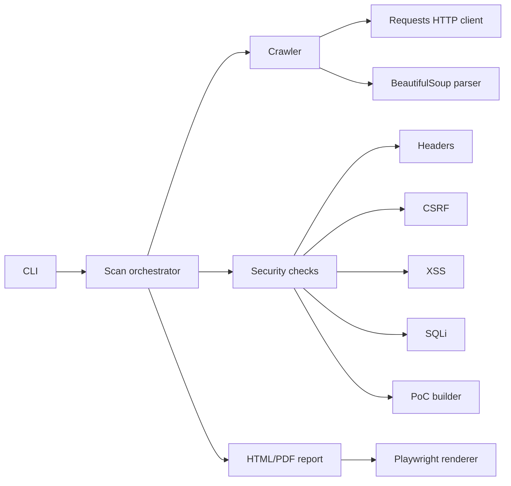

# Web Security Audit

`web-security-audit` is a Python CLI tool for authorized security checks of web
applications. It crawls a target, analyzes pages and forms, runs lightweight
checks for common issues, and generates HTML/PDF reports with proof-of-concept
evidence.

> Use this tool only on systems you own or where you have explicit permission to test.

## Features

- Site crawling with domain scoping, depth limits, page limits, and form extraction.
- Passive checks for unsafe or missing security headers.
- CSRF analysis for state-changing forms.
- Optional active XSS and SQL injection probes for discovered forms.
- Proof-of-concept generation for findings.
- HTML report generation and optional PDF rendering through Playwright.
- CI pipeline with tests, linting, SAST (`bandit`) and dependency audit (`pip-audit`).
- Docker and Docker Compose support.

## Architecture



More details are available in [docs/architecture.md](docs/architecture.md) and
[docs/api.md](docs/api.md).

## Project Structure

```text
src/websec_audit/        application source code
tests/                   unit and integration tests
.github/workflows/       CI, SAST and dependency checks
Dockerfile               container image for the scanner
docker-compose.yml       local container run example
```

## Installation

```bash
python -m venv .venv
source .venv/bin/activate
python -m pip install --upgrade pip
python -m pip install -e ".[dev]"
python -m playwright install chromium
```

On Windows PowerShell:

```powershell
python -m venv .venv
.\.venv\Scripts\Activate.ps1
python -m pip install --upgrade pip
python -m pip install -e ".[dev]"
python -m playwright install chromium
```

## Usage

Passive scan:

```bash
websec-audit https://example.com --no-active-checks --html-output reports/report.html
```

Full scan with active form probes and PDF output:

```bash
websec-audit https://example.com \
  --max-pages 30 \
  --max-depth 2 \
  --html-output reports/report.html \
  --pdf-output reports/report.pdf
```

Run with Docker Compose:

```bash
docker compose up --build
```

## Security Checks

- **Headers:** Content Security Policy, HSTS, X-Frame-Options,
  X-Content-Type-Options, Referrer-Policy and Permissions-Policy.
- **CSRF:** state-changing forms without a recognizable CSRF token field.
- **XSS:** reflected payload checks against discovered forms.
- **SQLi:** SQL error-pattern detection after submitting common injection probes.

Active checks submit generated payloads to forms. Keep them disabled for targets
where only passive assessment is permitted.

## Development

```bash
ruff check .
pytest
bandit -c pyproject.toml -r src
pip-audit
```

The repository follows conventional commits, for example `feat: add crawler` or
`test: cover csrf analyzer`.
