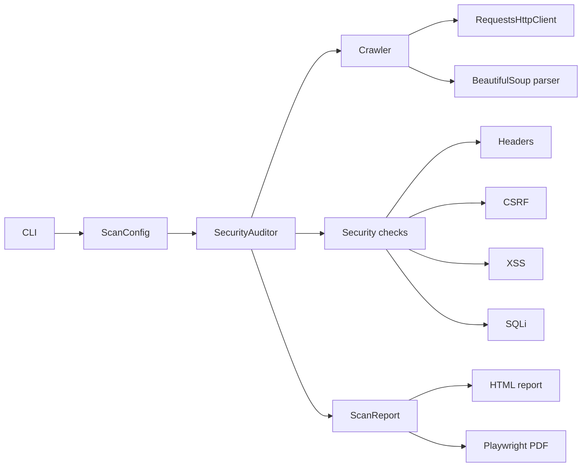

# Web Security Audit

## Данные студента

- ФИО: Holhalova Alina
- Группа: укажите номер группы

## Описание программы

`web-security-audit` — консольная программа для авторизованного аудита
безопасности веб-приложений. Инструмент обходит страницы целевого сайта,
извлекает ссылки и HTML-формы, выполняет пассивные и активные проверки типовых
уязвимостей, формирует доказательства Proof-of-Concept и сохраняет отчет в HTML,
PDF и JSON.

Программа предназначена для учебных стендов, лабораторных окружений и систем, на
тестирование которых есть явное разрешение. Активные проверки отправляют
payload-запросы в найденные формы, поэтому для внешних целей их нужно включать
только при наличии согласованного разрешения.

## Возможности

- Краулинг сайта с ограничением по домену, глубине и количеству страниц.
- Извлечение HTML-форм и нормализация относительных ссылок.
- Проверка небезопасных или отсутствующих security headers.
- Проверка state-changing форм на отсутствие CSRF-токена.
- Активная проверка reflected XSS через отправку payload в формы.
- Активная error-based проверка SQL injection.
- Генерация Proof-of-Concept в виде `curl`-команды.
- Отчеты в форматах HTML, PDF и JSON.
- Автоматические тесты с целевым покрытием более 90%.
- CI-пайплайн с тестами, линтингом, SAST и аудитом зависимостей.

## Используемые технологии

- Python 3.12
- requests
- BeautifulSoup4
- Playwright
- pytest и pytest-cov
- Ruff
- Bandit
- pip-audit
- Docker и Docker Compose

## Структура проекта

```text
src/websec_audit/          исходный код программы
src/websec_audit/checks/   проверки XSS, SQLi, CSRF и security headers
src/websec_audit/reporting/ генерация HTML/PDF отчетов
tests/                     автоматические тесты
docs/                      описание архитектуры и API
.github/workflows/         CI-пайплайн
```

## Инструкция по сборке

### Windows PowerShell

```powershell
python -m venv .venv
.\.venv\Scripts\Activate.ps1
python -m pip install --upgrade pip
python -m pip install -e ".[dev]"
python -m playwright install chromium
```

### Linux или macOS

```bash
python -m venv .venv
source .venv/bin/activate
python -m pip install --upgrade pip
python -m pip install -e ".[dev]"
python -m playwright install chromium
```

## Инструкция по запуску

Пассивное сканирование без отправки payload в формы:

```bash
websec-audit https://example.com --no-active-checks --html-output reports/report.html
```

Полное сканирование с активными проверками и PDF-отчетом:

```bash
websec-audit https://example.com \
  --max-depth 2 \
  --max-pages 30 \
  --html-output reports/report.html \
  --pdf-output reports/report.pdf \
  --json-output reports/report.json
```

Запуск через Docker Compose:

```bash
docker compose up --build
```

## Примеры запуска

Сканирование локального учебного стенда:

```bash
websec-audit http://localhost:8000 --max-depth 1 --max-pages 10
```

Сканирование HTTPS-стенда с самоподписанным сертификатом:

```bash
websec-audit https://lab.local --no-verify-tls --html-output reports/lab.html
```

Сканирование только поддоменов заданной цели:

```bash
websec-audit https://example.com --include-subdomains --max-depth 2
```

## Примеры запросов и API

### CLI

```bash
websec-audit TARGET [options]
```

Основные параметры:

- `TARGET` — абсолютный URL с протоколом `http` или `https`.
- `--max-depth` — максимальная глубина обхода, по умолчанию `2`.
- `--max-pages` — максимальное количество страниц, по умолчанию `50`.
- `--timeout` — таймаут HTTP-запроса в секундах.
- `--include-subdomains` — разрешить обход поддоменов.
- `--no-active-checks` — отключить активные XSS и SQLi проверки.
- `--no-verify-tls` — отключить проверку TLS-сертификата для лабораторных стендов.
- `--html-output` — путь к HTML-отчету.
- `--pdf-output` — путь к PDF-отчету.
- `--json-output` — путь к JSON-отчету.

### Python API

```python
from websec_audit.models import ScanConfig
from websec_audit.scanner import SecurityAuditor

config = ScanConfig(
    target_url="https://example.com",
    max_depth=2,
    max_pages=30,
    active_checks=False,
)

report = SecurityAuditor(config).run()
print(report.summary_by_severity)
```

Пример фрагмента JSON-отчета:

```json
{
  "target_url": "https://example.com",
  "summary_by_severity": {
    "info": 0,
    "low": 2,
    "medium": 1,
    "high": 1
  },
  "findings": [
    {
      "check_id": "headers.content-security-policy",
      "severity": "high",
      "recommendation": "Configure a strict Content-Security-Policy header."
    }
  ]
}
```

## Описание архитектуры

Архитектура разделена на небольшие компоненты с явными ответственностями:

- `cli.py` — разбор аргументов командной строки и сохранение отчетов.
- `scanner.py` — оркестратор сканирования.
- `crawler.py` — обход сайта в ширину с учетом scope, глубины и лимита страниц.
- `parser.py` — извлечение ссылок, заголовков страниц и HTML-форм через BeautifulSoup.
- `http_client.py` — HTTP-клиент на базе `requests`, изолированный протоколом.
- `checks/headers.py` — анализ security headers.
- `checks/csrf.py` — анализ CSRF-защиты HTML-форм.
- `checks/xss.py` — активная reflected XSS проверка.
- `checks/sqli.py` — активная error-based SQL injection проверка.
- `reporting/html_report.py` — генерация HTML и PDF-отчетов.



HTTP-клиент внедряется через интерфейс, поэтому проверки легко тестировать без
реальных сетевых запросов. Активные проверки отделены от пассивных и могут быть
отключены флагом `--no-active-checks`.

## Контроль качества

```bash
ruff check .
pytest
bandit -c pyproject.toml -r src
pip-audit
```

Коммиты в проекте ведутся в стиле conventional commits, например:
`feat: improve security header validation` или `test: cover active scanners`.
