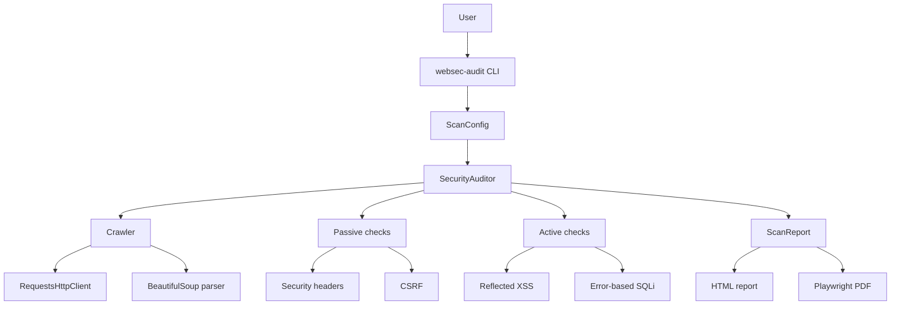

# Architecture

The scanner is organized around small components with explicit responsibilities.

## Components

- `cli.py`: parses user input and writes HTML, PDF and JSON artifacts.
- `scanner.py`: orchestrates crawling and checks.
- `crawler.py`: performs breadth-first crawling within the configured scope.
- `parser.py`: extracts links, titles and forms with BeautifulSoup.
- `http_client.py`: isolates `requests` access behind a protocol.
- `checks/headers.py`: detects missing or unsafe browser security headers.
- `checks/csrf.py`: detects state-changing forms without token fields.
- `checks/xss.py`: performs reflected XSS probes in active mode.
- `checks/sqli.py`: performs error-based SQL injection probes in active mode.
- `reporting/html_report.py`: renders HTML and optional PDF reports.

## Design Notes

- Active checks are optional because they submit payloads to target forms.
- The HTTP client is injectable, which keeps tests fast and avoids real network calls.
- The crawler enforces host scope, depth and page limits to prevent uncontrolled scans.
- Findings include evidence and remediation guidance so the report is useful for triage.
