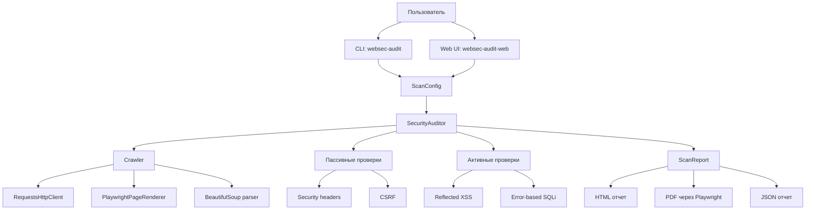

# Архитектура проекта

`Web Security Audit` построен как набор небольших компонентов с отдельными
зонами ответственности. Такой подход упрощает тестирование, расширение проверок
и замену инфраструктурных частей, например HTTP-клиента или генератора отчетов.

## Общая схема

## Основные компоненты

| Компонент | Ответственность |
| --- | --- |
| `cli.py` | Разбор аргументов командной строки, создание конфигурации, сохранение отчетов |
| `web.py` | Браузерный интерфейс для запуска пассивного/активного аудита, просмотра сводки и скачивания HTML/JSON/PDF |
| `models.py` | Доменные модели: `ScanConfig`, `Page`, `Form`, `Finding`, `ScanReport` |
| `scanner.py` | Оркестрация полного цикла аудита |
| `crawler.py` | Обход страниц с учетом домена, глубины и лимита страниц; поддерживает `requests`, `playwright` и `auto` |
| `parser.py` | Извлечение ссылок, заголовков страниц и HTML-форм |
| `http_client.py` | Изолированный HTTP-клиент на базе `requests` |
| `checks/headers.py` | Проверка отсутствующих и слабых security headers |
| `checks/csrf.py` | Проверка state-changing форм на наличие CSRF-токена |
| `checks/xss.py` | Активная проверка reflected XSS |
| `checks/sqli.py` | Активная проверка error-based SQL injection |
| `checks/payloads.py` | Формирование payload и Proof-of-Concept |
| `reporting/html_report.py` | Генерация HTML и PDF отчетов |

## Поток выполнения

1. Пользователь запускает `websec-audit` и передает целевой URL.
2. CLI валидирует URL и создает `ScanConfig`.
3. `SecurityAuditor` запускает `Crawler`.
4. Краулер получает страницы через `RequestsHttpClient` или рендерит DOM через `PlaywrightPageRenderer`.
5. HTML/DOM анализируется через `BeautifulSoup`: извлекаются ссылки, формы и title.
6. Для каждой страницы запускаются пассивные проверки заголовков и CSRF.
7. Если активные проверки включены, формы проверяются на XSS и SQLi.
8. Все результаты собираются в `ScanReport`.
9. Отчет сохраняется в HTML, при необходимости в PDF и JSON.

## Архитектурные решения

- HTTP-клиент описан протоколом и внедряется в краулер/сканеры. Благодаря этому
  тесты не выполняют реальные сетевые запросы.
- Активные проверки отделены от пассивных и отключаются флагом
  `--no-active-checks`.
- Краулер ограничивает область обхода, глубину и количество страниц, чтобы
  сканирование было контролируемым.
- Режим `auto` сначала использует быстрый `requests`-обход, а для страниц с признаками
  SPA без найденных ссылок и форм повторяет получение через Playwright. Режим
  `playwright` принудительно рендерит страницы в Chromium и подходит для сайтов,
  где навигация появляется только после выполнения JavaScript.
- Findings содержат severity, evidence, recommendation, CWE/OWASP и PoC, поэтому
  отчет пригоден не только для демонстрации, но и для последующего исправления.
- Генератор отчетов отделен от логики проверок, поэтому формат вывода можно
  расширять без изменения сканеров.
